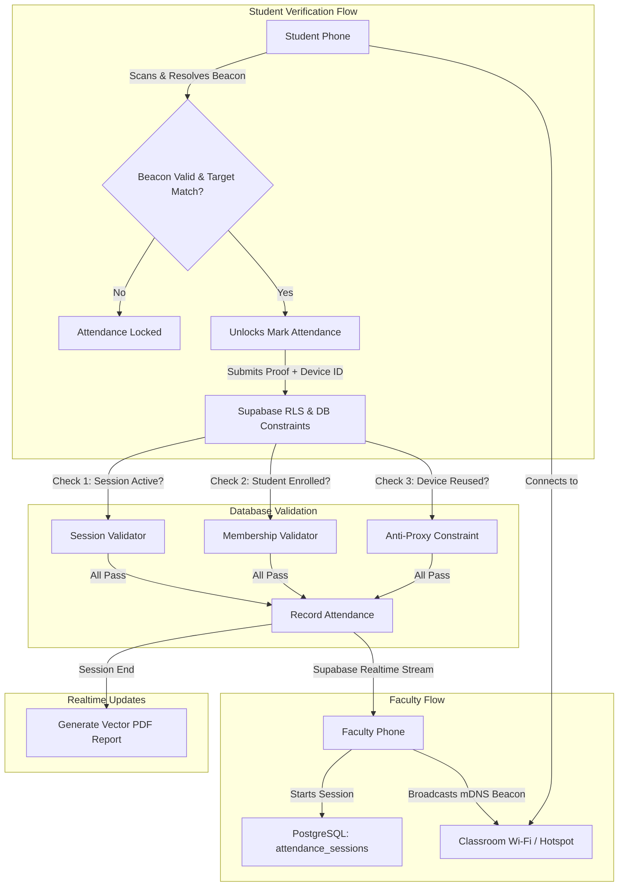

# SAS — Self Attendance System

[](https://github.com/Philips-Sujith/Self-Attendance-System/releases)
[](https://expo.dev)
[](https://reactnative.dev)
[](https://supabase.com)
[](LICENSE)

**SAS (Self Attendance System)** is a modern, proxy-resistant mobile attendance management platform engineered for universities and educational institutions. It empowers faculty instructors to launch localized attendance sessions in classrooms, while students self-mark their presence through physical local-network discovery, hardware-bound anti-proxy safeguards, and real-time database synchronization.

---

## Overview

Traditional classroom attendance methods—such as manual paper roll calls, projected static QR codes, or location check-ins—suffer from proxy attendance, QR code sharing via WhatsApp, GPS spoofing, and excessive faculty administrative burden.

SAS eliminates these vulnerabilities by enforcing a **multi-layer physical proximity model**:
1. **Local Network Beaconing**: Attendance sessions broadcast an encrypted mDNS/Bonjour service (`sas-session._tcp`) strictly over the classroom's local Wi-Fi or the teacher's personal mobile hotspot.
2. **Subnet-Isolated Self-Verification**: Students must be physically connected to the exact same Wi-Fi subnet or Teacher Hotspot to detect the broadcast beacon before attendance unlocks.
3. **Hardware Device Binding**: PostgreSQL-level unique constraints bind each student's attendance to their physical device fingerprint for the active session, preventing one device from marking attendance for multiple students.
4. **Instant Vector PDF Reports**: Upon ending a session, faculty can immediately export and share authoritative, print-safe A4 attendance PDF records with detailed timestamps and audit notes.

---

## Key Features

### 👨‍🏫 Faculty / Staff Portal
- **Course Group Management**: Create course groups with custom section names, schedules, and automatically generated alphanumeric Join Codes.
- **Roster Management**: Real-time roster tracking showing enrolled students, enrollment dates, and attendance percentages.
- **Live Attendance Sessions**: Launch timed sessions (3, 5, 10, or 15 minutes) with configurable class periods.
- **Live Realtime Counter**: Watch attendance marks sync in real time as students verify and mark attendance.
- **Manual Attendance Overrides**: Override attendance status (Present, Absent, Late) with required audit reasons directly from the live roster.
- **Institutional PDF & CSV Export**: Export high-resolution, multi-page vector PDF reports and semester-level master CSV files via the native device share sheet.

### 🎓 Student Portal
- **One-Time Course Enrollment**: Join courses quickly using faculty-provided 6-character Join Codes.
- **Zero-Friction Attendance**: Open the active session, let the app automatically verify local network proximity, and tap "Mark My Attendance".
- **Real-Time Network Feedback**: Clear visual indicators when the classroom network is detected, scanning, or unavailable.
- **Personal Attendance History**: Review past session records, marked timestamps, and enrollment details.

### 🛡️ Security & Anti-Proxy Architecture
- **No GPS Spoofing Vulnerability**: Proximity is verified via local multicast DNS packet resolution over local Wi-Fi / Hotspot networks, rendering GPS spoofing apps useless.
- **Row Level Security (RLS)**: Fine-grained PostgreSQL RLS policies ensure students can only mark their own attendance within open sessions, and faculty can only manage their owned course groups.
- **Rate-Limiting & In-Flight Mutex**: Authentication and attendance submission endpoints feature in-flight mutex locks and debounce protection.
- **Subnet Isolation Protection**: Remote students connected to external Wi-Fi or cellular mobile data cannot resolve the teacher's local beacon.

---

## Technology Stack

| Layer | Technology | Purpose |
| --- | --- | --- |
| **Frontend Framework** | React Native (0.86.3) / Expo SDK 57 | Cross-platform native mobile application |
| **Navigation** | React Navigation v7 | Type-safe stack and bottom tab navigation |
| **Local Discovery** | react-native-zeroconf | Native mDNS / Bonjour multicast beacon discovery |
| **Backend / Database** | Supabase (PostgreSQL 15) | Relational persistence, Row-Level Security, and Realtime |
| **Authentication** | Supabase GoTrue Auth | Secure JWT-based role authentication (Staff & Student) |
| **Secure Storage** | Expo SecureStore | Hardware-backed encrypted credential and key storage |
| **Document Export** | expo-print & expo-sharing | Vector PDF rendering and system share sheet integration |
| **Build Pipeline** | EAS Build (Expo Application Services) | Cloud-native Android APK / AAB compilation |
| **Testing** | Jest & ts-jest | 11 automated test suites covering 365 test assertions |

---

## Application Architecture



---

## Repository Structure

```
SAS/
├── src/
│   ├── components/          # Reusable design system (Badge, Button, Card, Header, Input)
│   ├── config/              # Environment configuration & Supabase client settings
│   ├── constants/           # Theme definitions, dark-mode colors, typography, spacing
│   ├── context/             # AuthContext providing authentication state & role routing
│   ├── navigation/          # React Navigation stacks (Auth, Staff, Student, Root)
│   ├── screens/
│   │   ├── auth/            # Welcome, StaffAuth, StudentAuth screens
│   │   ├── shared/          # Network diagnostic utilities
│   │   ├── staff/           # Dashboard, GroupDetail, SessionLive, Reports, Roster screens
│   │   └── student/         # Dashboard, Session, JoinGroup, Profile screens
│   ├── services/            # Core business logic (Auth, Group, Session, Network, PDF, CSV)
│   └── types/               # TypeScript interfaces, data models, navigation param lists
├── assets/                  # High-resolution icons, adaptive icons, and splash screens
├── supabase/
│   ├── migrations/          # Versioned PostgreSQL migrations for RLS & constraints
│   └── schema.sql           # Complete authoritative database schema
├── __mocks__/               # Jest runtime mocks for Expo native modules
├── __tests__/               # 11 comprehensive automated test suites (365 unit/integration tests)
├── app.json                 # Expo application manifest & native permissions config
├── eas.json                 # EAS build profiles (development, preview APK, production)
├── package.json             # Project dependencies and npm scripts
├── tsconfig.json            # Strict TypeScript configuration
├── .env.example             # Template environment file with credential placeholders
├── .gitignore               # Production-grade git exclusion rules
├── LICENSE                  # MIT License
└── README.md                # Project documentation
```

---

## Getting Started & Local Setup

### Prerequisites
- **Node.js**: `v18.x` or later (Node.js 20+ LTS recommended)
- **npm** or **yarn**
- **Expo CLI**: Installed globally or executed via `npx`
- **Android Studio / Physical Android Device** for native network proximity testing

### 1. Clone the Repository
```bash
git clone https://github.com/Philips-Sujith/Self-Attendance-System.git
cd Self-Attendance-System
```

### 2. Install Dependencies
```bash
npm install
```

### 3. Configure Environment Variables
Copy `.env.example` to `.env` and provide your Supabase project credentials:
```bash
cp .env.example .env
```
Edit `.env`:
```env
EXPO_PUBLIC_SUPABASE_URL=https://your-project-id.supabase.co
EXPO_PUBLIC_SUPABASE_ANON_KEY=your-anon-publishable-key
```

### 4. Setup Supabase Database
1. Create a new project on [Supabase](https://supabase.com).
2. Open the **SQL Editor** in the Supabase Dashboard.
3. Run the complete database definition from [`supabase/schema.sql`](supabase/schema.sql).
4. Run subsequent migration scripts in [`supabase/migrations/`](supabase/migrations/) to apply the latest RLS security enhancements.

### 5. Start Development Server
```bash
npx expo start
```

---

## Building for Production (EAS Build)

SAS uses **Expo Application Services (EAS Build)** to compile standalone Android APKs and Google Play App Bundles (AAB).

### 1. Install EAS CLI
```bash
npm install -g eas-cli
```

### 2. Log in to your Expo Account
```bash
eas login
```

### 3. Build Standalone Preview APK (Direct Installation)
To generate an installable `.apk` file for testing on physical Android devices:
```bash
eas build -p android --profile preview
```

### 4. Build Production Bundle (Google Play Store)
To generate an optimized `.aab` (Android App Bundle) for Google Play release:
```bash
eas build -p android --profile production
```

---

## Testing & Quality Assurance

The SAS project includes an automated test suite with **365 tests** across **11 test suites** validating every layer of the application.

### Running the Test Suite
```bash
npm test
```

### TypeScript Validation
```bash
npx tsc --noEmit
```

### Test Coverage Summary

| Test Suite | Focus Area | Assertions | Status |
| --- | --- | --- | --- |
| `wifiMdns.test.ts` | Wi-Fi & mDNS Discovery, Network Matrix, Hotspot Handling | 44 | ✅ Passed |
| `rlsSecurity.test.ts` | Supabase RLS Policies, Ownership Checks, Anti-Proxy Guard | 38 | ✅ Passed |
| `auth.test.ts` | Rate-Limit Mutex, Session Persistence, Role Routing | 36 | ✅ Passed |
| `attendanceSessions.test.ts` | Live Session Lifecycle, Countdown Timer, Realtime Sync | 32 | ✅ Passed |
| `manualOverride.test.ts` | Staff Overrides, Audit Reason Validation, DB Persistence | 28 | ✅ Passed |
| `courseGroups.test.ts` | Course Creation, Join Code Generation & Enrollment | 24 | ✅ Passed |
| `databaseIntegration.test.ts` | Foreign Keys, Database Cascades, Integrity Rules | 20 | ✅ Passed |
| `e2eScenarios.test.ts` | End-to-End Classroom Multi-Student Workflows | 45 | ✅ Passed |
| `safeAreaUI.test.ts` | Mobile Safe-Area Insets, Typography, Touch Targets | 28 | ✅ Passed |
| `uiPolishQA.test.ts` | Print-Safe PDF Rendering, Multi-Page Tables, XSS Sanitization | 8 | ✅ Passed |
| `appStateNavigation.test.ts` | Backgrounding/Foregrounding mDNS Lifecycles | 62 | ✅ Passed |
| **Total** | **Full System Verification** | **365** | **100% Pass** |

---

## Download & Releases

Pre-compiled Android APK binaries are distributed directly via GitHub Releases:

- **Latest Stable Release**: [`SAS v1.0.0`](https://github.com/Philips-Sujith/Self-Attendance-System/releases/tag/v1.0.0)
- **Artifact**: `SAS-v1.0.0.apk`

---

## License

This project is licensed under the MIT License — see the [LICENSE](LICENSE) file for details.
